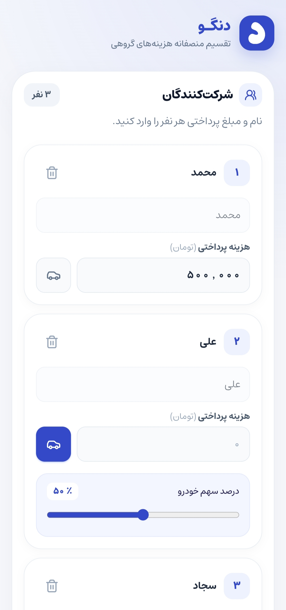
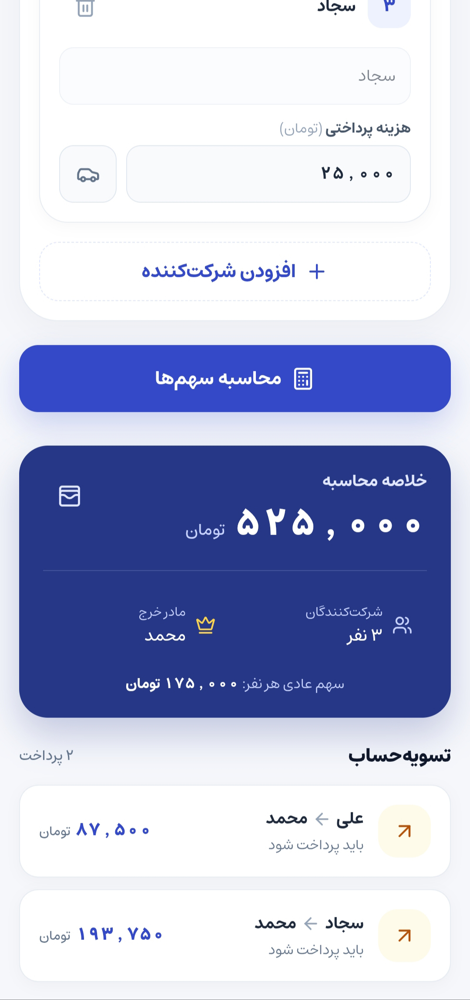

# Dongo

Dongo is a simple offline expense-sharing application designed to calculate group payments and split costs fairly in the Persian language.

With Dongo, you can add group members, enter their expenses, apply custom conditions such as vehicle contribution, and calculate the final settlement between members.

The app works completely offline and does not require an account or internet connection.

## Features

* Add and remove members from the expense list
* Enter each person's name and paid amount
* Automatically select the highest contributor as the main payer
* Support for zero and decimal amounts
* Enable vehicle contribution for individual members
>Anyone who brings their own car to ride can pay a lower percentage of the fare.
* Adjust vehicle contribution percentage from 0% to 100%
* Automatically calculate each person's final share
* Show how much each person should pay or receive from the main payer
* Fully offline functionality with no internet dependency

## Screenshots

<p align="center">
  
  
</p>


## Installation

### Install from GitHub Release

1. Download the latest APK from the Releases section.
2. Install the APK on your Android device.
3. Open the app and start adding your expenses.

> You may need to enable installation from unknown sources to install APK files outside the Google Play Store.

## Tech Stack

* React
* Vite
* Capacitor
* Android Native
* Gradle

## Development

Install project dependencies:

```bash
npm install
```

Run the development server:

```bash
npm run dev
```

Build the production version:

```bash
npm run build
```

Sync changes with Android:

```bash
npx cap sync android
```

Run the app on Android:

```bash
npx cap run android
```

## License

This project is licensed under the MIT License.

---

Built with React and Capacitor for a simple, fast, and offline expense-sharing experience.
